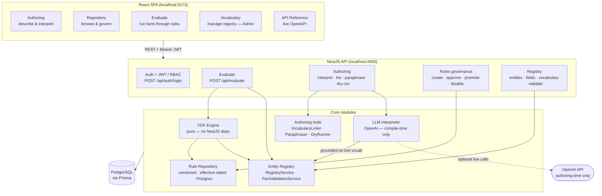
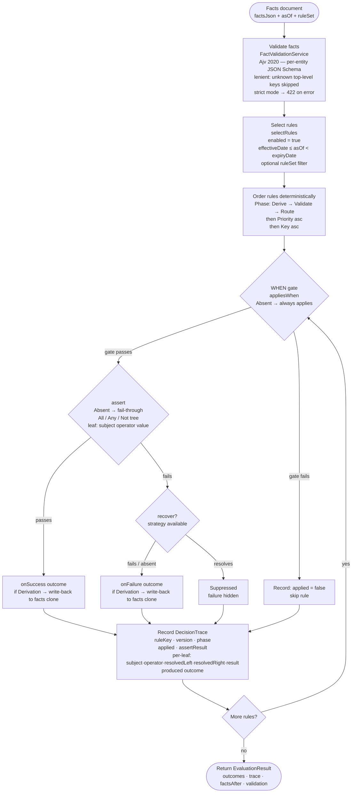
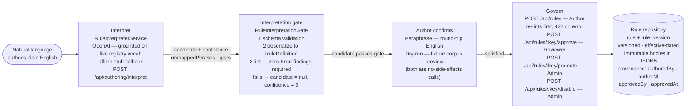
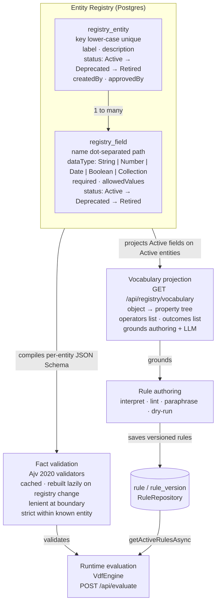
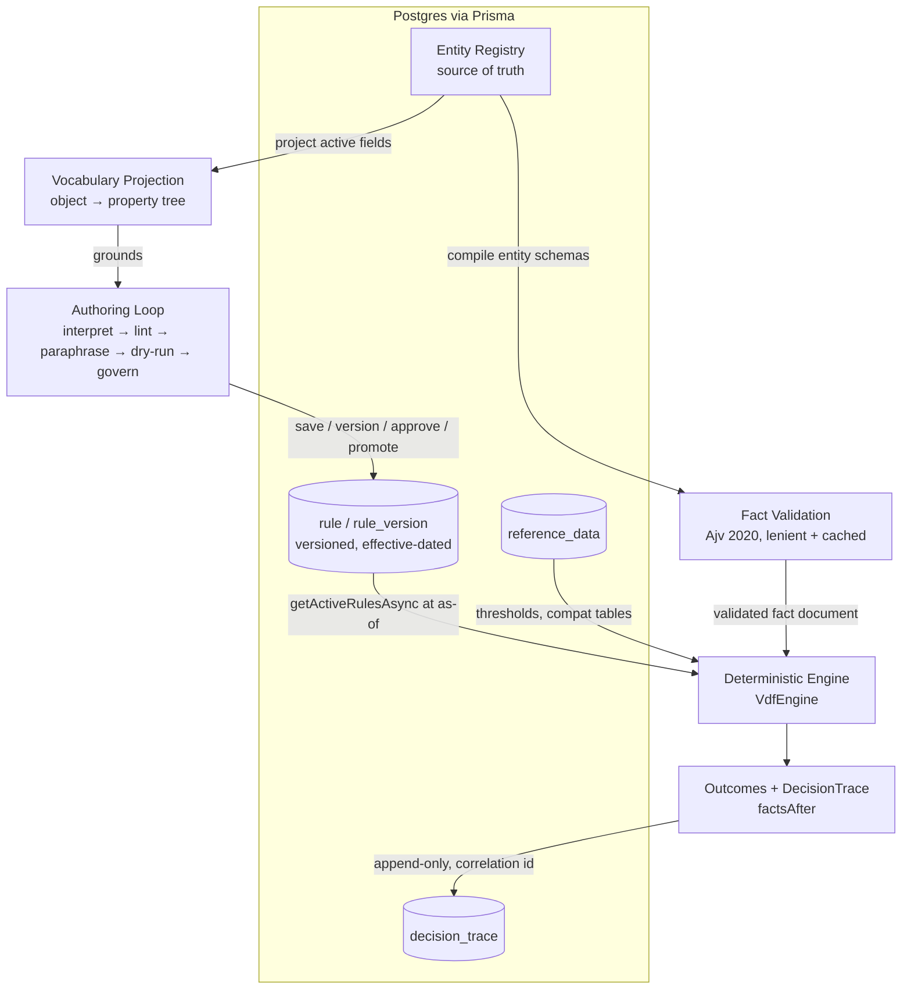

# VDF Architecture (Node / NestJS, registry-first)

The **IAW VDF** (Validation & Decision Framework) is a deterministic, config-driven
clinical rule engine. This document describes the **Node / NestJS** implementation that
supersedes the retired .NET stack. It reads bottom-up — from the **entity registry**,
the source of truth for the domain vocabulary, up through validation, the pure decision
engine, persistence, and the compile-time authoring loop — and explains how the three
core guarantees (**determinism, explainability, auditability**) are enforced by
construction.

---

## Diagrams

Four Mermaid diagrams follow. GitHub renders `mermaid` fenced blocks natively. The ASCII
pipeline diagram in section 1 is kept as a text fallback.

### Diagram 1 — System overview



### Diagram 2 — Evaluation pipeline



### Diagram 3 — Authoring loop



### Diagram 4 — Registry-first data model



---

> Source of truth for everything below is `src/server/src` (NestJS) and
> `src/server/prisma/schema.prisma` (Postgres via Prisma).

---

## 1. End-to-end pipeline

```
                          ┌──────────────────────────────────────────────────┐
                          │             ENTITY REGISTRY (N1)                  │
                          │  source of truth — entities (nouns) + typed       │
                          │  fields (properties), Active→Deprecated→Retired   │
                          │  RegistryService · Postgres (registry_entity,     │
                          │  registry_field) · Admin-only, audited mutations  │
                          └───────────────┬───────────────────┬───────────────┘
                                          │ projects           │ compiles
              ┌───────────────────────────┘                   └───────────────────────────┐
              ▼                                                                             ▼
   ┌────────────────────────────────┐                              ┌─────────────────────────────────┐
   │  VOCABULARY PROJECTION          │                              │  RUNTIME FACT VALIDATION (Ajv)    │
   │  VocabularyProjectionService    │                              │  FactValidationService            │
   │  object → property paths        │                              │  schema-compiler → JSON Schema    │
   │  (e.g. specimen.fixationTime)   │                              │  (Ajv 2020), lenient, cached,     │
   │  + operators + outcomes         │                              │  rebuilt lazily on registry change│
   │  GET /api/registry/vocabulary   │                              │  POST /api/registry/validate      │
   └───────────────┬─────────────────┘                              └─────────────────┬───────────────┘
                   │ grounds                                                          │ validated facts
                   ▼                                                                  ▼
   ┌────────────────────────────────┐                              ┌─────────────────────────────────┐
   │  AUTHORING LOOP (compile-time)  │                              │  DETERMINISTIC ENGINE             │
   │  interpret (LLM, grounded) →    │   proposes versioned rules   │  VdfEngine  (src/server/src/vdf)  │
   │  lint → paraphrase → dry-run →  │ ───────────────────────────► │  clone → select → evaluate →      │
   │  govern (save/version/approve/  │                              │  derive (write-back) → dispatch   │
   │  promote). LLM = PROPOSAL only. │                              │  Clock-injected ⇒ reproducible    │
   └────────────────────────────────┘                              └─────────────────┬───────────────┘
                                                                                      ▼
                                                                    ┌─────────────────────────────────┐
                                                                    │  OUTCOMES + DECISION TRACE        │
                                                                    │  { outcomes, trace, factsAfter }  │
                                                                    │  full per-rule explainability     │
                                                                    └─────────────────────────────────┘

   ┌──────────────────────────────────────────────────────────────────────────────────────────────┐
   │  PERSISTENCE  —  Postgres via Prisma                                                            │
   │  registry_entity · registry_field · rule · rule_version (versioned, effective-dated) ·         │
   │  reference_data · decision_trace (append-only, correlation-id, no PHI)                          │
   └──────────────────────────────────────────────────────────────────────────────────────────────┘
```

The same pipeline as a flow graph:



---

## 2. Entity registry — the source of truth (bottom-up)

The registry models the domain itself. It is the **bottom layer** on which everything
else stands: there is no separate, standalone vocabulary list — the legal subjects the
engine and authoring tooling ground on are exactly the **Active fields on Active
entities**.

**Shape** (`registry_entity`, `registry_field` in `schema.prisma`):

- **Entity** — a transaction object (a noun / class). `key` is stored canonical
  lower-case and uniquely indexed, so `"Kit"` and `"kit"` can never coexist; this
  replaces the legacy free-text "object = first path segment" approach that permitted
  duplicate, ambiguous vocabulary. Carries `label`, `description`, `status`, and
  provenance (`createdBy`, `approvedBy`/`approvedAt`).
- **Field** — a typed property on an entity. `name` is the path **relative** to the
  entity (e.g. `fixationTime`, `client.nyStatus`, or `specimens[]` for a collection),
  unique within its owning entity. Each field declares a `dataType`
  (`String | Number | Date | Boolean | Collection`), an optional `required` flag, and an
  optional **closed set of `allowedValues`** (an enum, e.g. `specimen.type`,
  `patient.gender`); empty `allowedValues` means unconstrained.

The canonical **subject path** consumed by rules and the engine is
`${entity.key}.${field.name}` (e.g. `specimen.fixationTime`).

**Canonical seeded entities** (`registry.seed-data.ts`): `order`, `test`, `specimen`,
`patient`, `document`, `incident`, `medicalReview`, `priorTimepoint`.

**Lifecycle** — every entity and field flows `Active → Deprecated → Retired`:

- **Deprecated** artifacts stay *resolvable* so live rules don't break, but drop out of
  projection and runtime validation.
- **Retired** is a hard delete, permitted **only** when the artifact is already
  Deprecated **and** unreferenced by any rule (`retireEntity` / `retireField` enforce
  both gates).

**Governance** — all registry mutations (`createEntity`, `addField`, `deprecate*`,
`retire*`) are **Admin-only** and audited; the read endpoints (`GET /entities`,
`GET /vocabulary`, `POST /validate`) are open to any authenticated caller
(`RegistryController`). Mutations fire a **change hook** (`registerChangeListener`) that
downstream consumers (notably fact validation) subscribe to.

---

## 3. Vocabulary projection

`VocabularyProjectionService` projects the registry into the **controlled vocabulary**
that grounds both authoring and the LLM interpreter. It loads Active fields on Active
entities and emits:

- **`projectPaths()`** — the flat, sorted list of legal subject paths. This *is* the
  engine grounding set (identical to `RegistryService.getSubjectPaths`).
- **`project()`** — `GroundingVocabulary`: each path plus its declared `dataType` and
  `allowedValues` (the type-aware grounding the linter consumes).
- **`projectTree()`** — the authoring **OBJECT → PROPERTY tree** the UI scope-picker
  consumes: objects (first path segment, e.g. `order`) with humanized labels
  (`medicalReview → "Medical Review"`), each carrying its sorted properties (e.g.
  `specimen.fixationTime`), **plus** the engine's closed `operators` and `outcomes`
  name lists. Surfaced at `GET /api/registry/vocabulary`.
- **`resolveScope(objects?, properties?)`** — narrows the grounding surface for a scoped
  interpret request. Property scope (exact paths) takes precedence over object scope;
  every requested object/property must resolve, so the UI can never silently scope the
  interpreter to nothing.

Because the projection reads the live registry, **adding a field makes its path appear
immediately** and **deprecating an entity/field removes it** — there is exactly one
vocabulary, and it is the registry.

---

## 4. Runtime fact validation (Ajv)

At runtime, a **fact document** — a JSON object keyed by entity (e.g.
`{ "specimen": { … }, "patient": { … } }`) — is validated against the registry by
`FactValidationService` before it reaches the engine.

- For each Active entity, `compileEntitySchema` (the **schema-compiler**) builds a
  **JSON Schema** from its Active fields; the matching sub-document is validated with
  **Ajv 2020** (`allErrors: true`, formats enabled).
- **Lenient by design**:
  - **Unknown top-level keys are skipped** — the registry does not own them.
  - Within a **known** entity, type mismatches, bad enum (`allowedValues`) values, and
    **missing required** fields are reported; **extra unmodelled fields are tolerated**.
- Compiled validators are **cached**; the service subscribes to the registry change hook
  in `onModuleInit` and marks the cache **stale**, so it is **rebuilt lazily** on the
  first validation after any registry mutation.
- Errors are **entity- and path-scoped and message-only** (`{ entity, path, message }`),
  with paths rooted at the entity key (e.g. `specimen.fixationTime`) — **no PHI**, never
  the offending value.

Exposed at `POST /api/registry/validate`.

---

## 5. The deterministic engine

The pure `VdfEngine` (`src/server/src/vdf`) carries **no NestJS dependency** — it is an
embeddable, side-effect-free evaluator. A single `evaluate(request)` call
(`{ facts, asOf, ruleSet? }`) runs:

1. **Clone facts** — the working document is a deep copy; **the caller's facts are never
   mutated**. All derivations are written into the clone and returned as `factsAfter`.
2. **Select** — `selectRules` filters to applicable rules (optionally partitioned by
   `ruleSet`) whose effective window contains `asOf`, then orders them **deterministically
   and totally**: **phase** (`Derive → Validate → Route`) → **priority** → **key**.
3. **Evaluate each rule**:
   - **WHEN** — the `appliesWhen` gate. Absent ⇒ always applies; if it doesn't hold, the
     rule is recorded *not applied* and skipped.
   - **DECISION** — `assert`. An absent assert falls through to failure (derivation rules
     rely on this). Conditions are a recursive `All / Any / Not` tree over leaf
     conditions (subject + operator + literal/reference comparand + quantifier).
   - On **assert-true** ⇒ apply `onSuccess`; if it is a **Derivation** outcome, its
     target value is **written back** into the working facts.
   - On **assert-false** ⇒ attempt `recover` (e.g. `apply-default`); if recovery resolves,
     the failure is **suppressed**; otherwise produce `onFailure` (which may itself be a
     derivation that writes back).
4. **Derivations write back** into the working facts so **later-phase rules observe
   them** — this is rule chaining, and the reason `Derive` runs first.
5. **Dispatch** — produced outcomes are handed to any registered `OutcomeHandler`s. This
   is the **only** side-effect boundary; the engine itself never touches the outside
   world.
6. **Return** `{ outcomes, trace, factsAfter }`.

**Time enters only via `Clock`.** Tests inject a `FixedClock`, so the same request
evaluated twice produces identical outcomes and (modulo the fixed clock) identical
traces — **fully reproducible**.

---

## 6. Outcomes and decision trace

**Outcomes** belong to semantic groups (`groupFor`):

| Group | Outcome types |
|-------|---------------|
| **None** | `Continue`, `Suppressed` |
| **Validation** | `CompleteHold`, `PartialHold`, `Warning`, `ComplianceAlert` |
| **Workflow** | `RouteToReview`, `RouteToQueue`, `Escalate` |
| **Derivation** | `SetValue`, `ApplyDefault`, `CalculateValue` |
| **Entity** | `CreatePlaceholder`, `CreateIncident`, `CreateTask` |
| **Control** | `PreventAction`, `AllowAction` |

Every **evaluated** rule emits a `DecisionTrace` — the explainability artifact:

- `ruleKey`, `version`, `phase`, `applied`, `assertResult`
- **per-leaf `conditions`**: `subject`, `operator`, `quantifier`, `resolvedLeft`,
  `resolvedRight`, `result` (AND/OR are evaluated **without short-circuit** so the trace
  is complete)
- `recoveryAttempted`, `recoveryResolved`
- the `produced` outcome, `factsRead`, and the `evaluatedAt` clock instant

`factsAfter` exposes the post-derivation fact document, completing the audit picture.

---

## 7. Persistence

Postgres via **Prisma** (`schema.prisma`). Snake_case columns, `timestamptz`, JSONB
bodies.

**Versioned, effective-dated, governed rules**:

- **`rule`** — the stable identity row, one per rule `ruleKey` (e.g. `"PM17"`); mutable
  metadata only (`name`, `ruleSet`, `priority`, `phase`, `enabled`).
- **`rule_version`** — an **append-only, immutable** body. The entire `RuleDefinition`
  (condition tree + outcomes + recovery) is serialized as **JSONB** in `definitionJson`
  (no relational decomposition). Carries effective-dating (`effectiveDate` inclusive,
  `expiryDate` exclusive), an `isActive` "currently live" flag, and **provenance**
  (`authoredBy`, `authorNl`, `interpreterVersion`, `approvedBy`, `approvedAt`).

`RuleRepository` resolves the active version **at an as-of instant**
(`getActiveRulesAsync(asOf, ruleSet?)` windows on `effectiveDate ≤ asOf < expiryDate`),
and supports `saveAsync` (add-version with effective dates), `approve` (records the
authenticated approver + timestamp), and `setEnabled` (promote / disable).

**Reference data** (`reference_data`) — policy thresholds and compatibility tables are
DB-backed too, keyed by `(source, key)` with a JSONB value, resolved by the engine's
reference provider.

**Decision traces** (`decision_trace`) — persisted **append-only** under a
**correlation id** by `DecisionTraceStore`. This is the audit ledger: it stores the
rule/condition/outcome metadata only — **no PHI and no facts are logged**.

**Engine-over-DB parity** — `RuleEvaluationService` loads the active rules and reference
data for the requested instant and runs the same `VdfEngine`, proving **identical
outcomes** whether the engine is grounded on the on-disk corpus or the Postgres-backed
repository.

---

## 8. The authoring loop (compile-time)

Rules are authored **offline**, never at runtime. The loop turns natural language into a
governed, versioned rule, with a deterministic gate as the source of truth for validity:

1. **interpret** — natural language → a **candidate** `RuleDefinition` via the LLM
   (`RuleInterpreterService`), grounded on the live registry vocabulary (optionally
   narrowed by `resolveScope`). When the live interpreter is unavailable (disabled / no
   key / network error) it **transparently falls back to a deterministic offline stub**;
   it never leaks provider detail. `POST /api/authoring/interpret` (Author).
2. **lint** — the **registry-grounded `VocabularyLinter`**: every subject, operator,
   reference, and value must resolve to the controlled vocabulary (type-aware, including
   `allowedValues`). `POST /api/authoring/lint` (Author).
3. **paraphrase** — a **deterministic** English rendering of the candidate for
   round-trip confirmation. `POST /api/authoring/paraphrase` (Author).
4. **dry-run** — evaluate the candidate against the **repo fixtures corpus** with **no
   side effects**, previewing which fixtures it would fire on.
   `POST /api/authoring/dry-run` (Author).
5. **govern** — **save → version → approve → promote**: `POST /api/rules` and
   `POST /api/rules/:key/versions` (Author) append immutable versions;
   `POST /api/rules/:key/approve` (Reviewer) records the authenticated approver;
   `POST /api/rules/:key/promote` and `/disable` (Admin) flip the live flag.

**The LLM output is always a PROPOSAL.** The deterministic gate
(`RuleInterpretationGate`) is the source of truth: regardless of what the model claimed,
a candidate is returned only if it (a) passes the rule JSON schema, (b) deserializes into
a `RuleDefinition`, and (c) **lints clean with zero Error findings** against the live
registry. Any Error becomes a *propose-new-term* gap and the candidate is **suppressed**
(`candidate = null`, confidence `0`); warnings keep the candidate but dampen confidence.
**The LLM is never in the runtime decision path.**

---

## 9. Cross-cutting properties — by construction

- **Determinism** — facts are cloned (input never mutated); rule selection is total and
  stable (phase → priority → key); time enters only via an injected `Clock`. The same
  request always yields the same outcomes, and the same traces under a `FixedClock`. The
  engine-over-DB path is verified to match the on-disk corpus.
- **Explainability** — every evaluated rule emits a full `DecisionTrace` (per-leaf
  resolved values and results, recovery attempts, produced outcome), plus `factsAfter`.
- **Auditability** — rule provenance (`authoredBy`, `authorNl`, `interpreterVersion`,
  `approvedBy`, `approvedAt`) rides on each immutable version; decision traces are
  append-only under a correlation id; registry mutations are Admin-only and audited; logs
  are redacted and structured. **No PHI or facts are ever persisted in traces or logs.**

## 10. Scope & known gaps / future work

### 10.1 Authoring is validate-only (derive & route deferred)

**Decision:** NL authoring is intentionally scoped to **Validation-phase rules** — the
"require / hold / flag / alert / prevent" family. The engine fully supports `Derive` and
`Route` phases at runtime, but authoring them is **deferred** until how they should be
processed (and grounded) is properly defined. The simpler, honest product surfaces only
what it can reliably author.

Concretely:
- The interpreter has **no derive/route builder**; a derive/route request simply fails to
  ground and degrades gracefully (no candidate + a clear gap), like any unsupported
  sentence. Nothing is invented.
- The authoring **example chips** list only validation prompts.
- The corpus **derive/route rules are disabled** in the repository so it reads
  validate-only: `BL20`, `BL21`, `BL3`, `BL27` (derive) and `PM49`, `PM35_TIME` (route).
  Their JSON stays in `rules/*.json` and their fixtures are untouched — re-enabling them
  (or re-importing into a fresh DB) brings them straight back. The 20 enabled rules are
  all `Validate`-phase.

### 10.2 What re-enabling derive will require

Two derivation shapes exist in the corpus, both runtime-valid:

| Pattern | Example | Shape | Value source |
|---|---|---|---|
| **Set-on-condition** | BL20, BL21, BL3 | guard → *no `assert`* → `onFailure: SetValue(Target, Value)`, phase `Derive` | a **literal** |
| **Default-on-absence** | BL27 | `assert: <field> IsPresent` → `recover: apply-default(Target, Reference)` → `onFailure: Suppressed` | a **reference** (e.g. `PolicyDefaults.fallbackGender`) |

When derive authoring returns, the planned approach is a **deterministic builder**: the
model extracts slots `{guard, target, value}` and code assembles the shape (so the model
never authors the awkward no-`assert`/`onFailure` form). It also requires closing a
grounding hole: the gate must validate a derivation **`Target`** is a real subject and its
**`Value`** is within `allowedValues` (today only the *presence* of `Target` is checked).

### 10.3 What re-enabling route will require

Corpus routing rules (`PM49`, `PM35_TIME`) take the shape: phase `Route`, a guard, an
optional `assert`, and `onFailure: RouteToReview{ Destination: <named review queue> }`
(e.g. `MedicalReview`, `EscalationQueue`). Two prerequisites:
- a **closed set of routing destinations** so the gate can ground `Destination` (today the
  linter only checks it is *present*, not that it is a known target — a silent-invention
  hole mirroring the derivation `Target` one); and
- a **routing builder** analogous to the derivation one (slots `{guard, assert?,
  destination}` → the `RouteToReview` shape).

Note routing targets **review queues**, not arbitrary labs — "route to the NY performing
lab" is not how the corpus models NY handling (that is the `ComplianceAlert` in `BL8`).

### 10.4 `recover` flow & its grounding gap

The `recover` flow sits between an assertion failure and the failure outcome
(`engine.ts`): when `assert` fails, a defined `recover` strategy runs via `tryRecover`; on
success it produces `Suppressed` (the failure is healed), otherwise `onFailure` fires.
`apply-default` (resolve `Reference`/`Value` → `setPath` into `Target`) is implemented;
`find-alternate-specimen` is a runtime **stub**. `recover` is wired at runtime but exists
only in the hand-authored corpus (BL27) — there is **no authoring path** for it (it is the
default-on-absence half of derive above). When added, `recover.parameters.Target` must be
grounded as a known subject (`lintRecovery` validates `Reference` via `LINT004` but not
`Target`).
