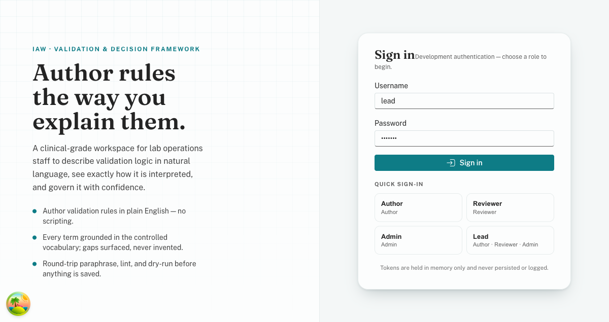
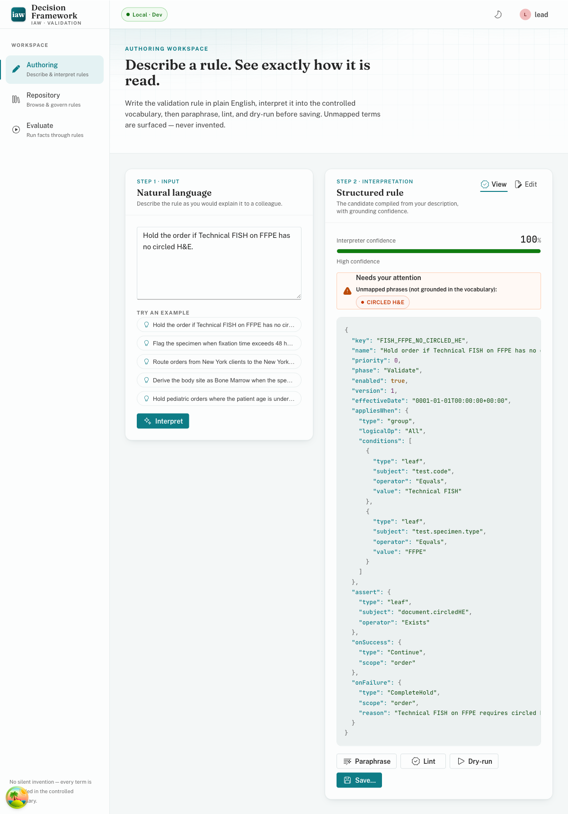
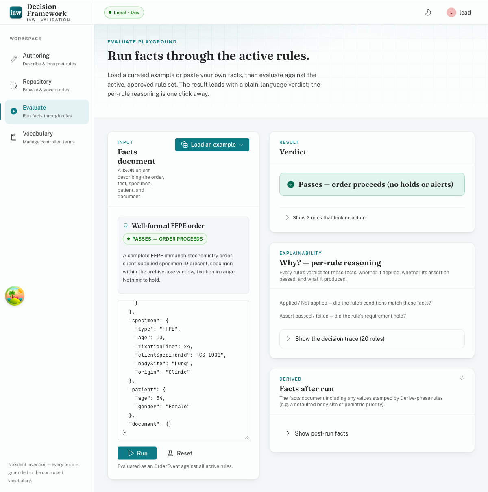
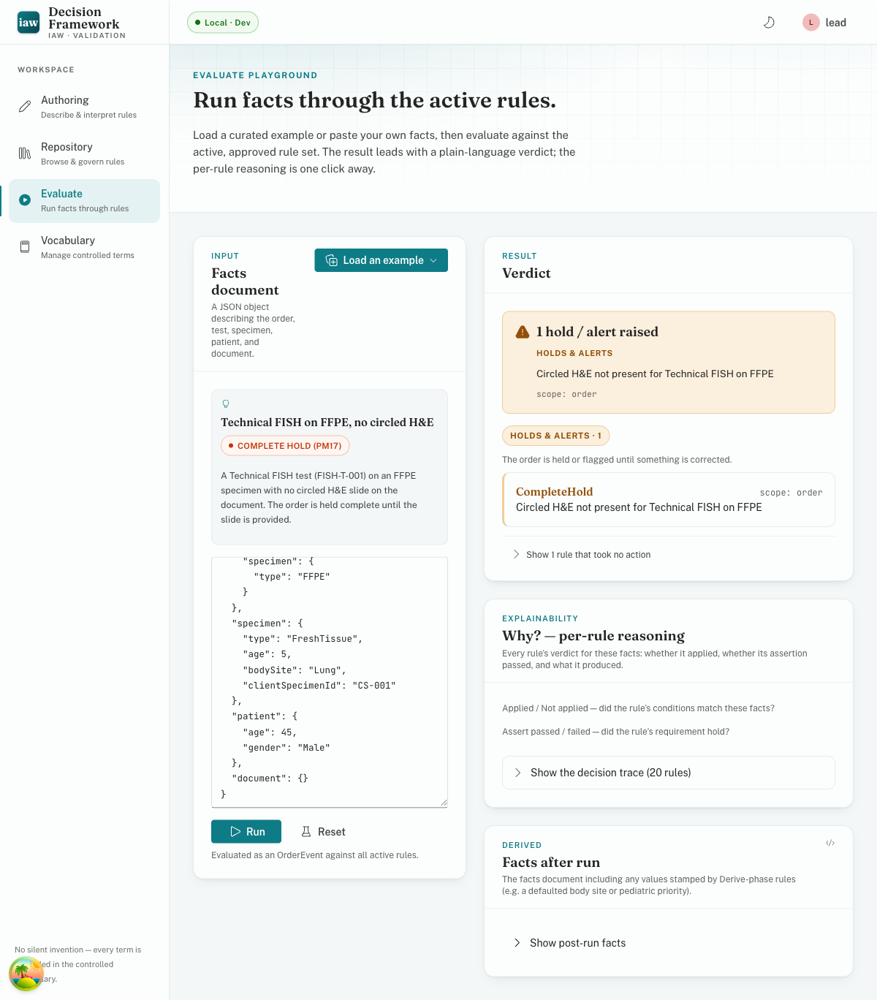
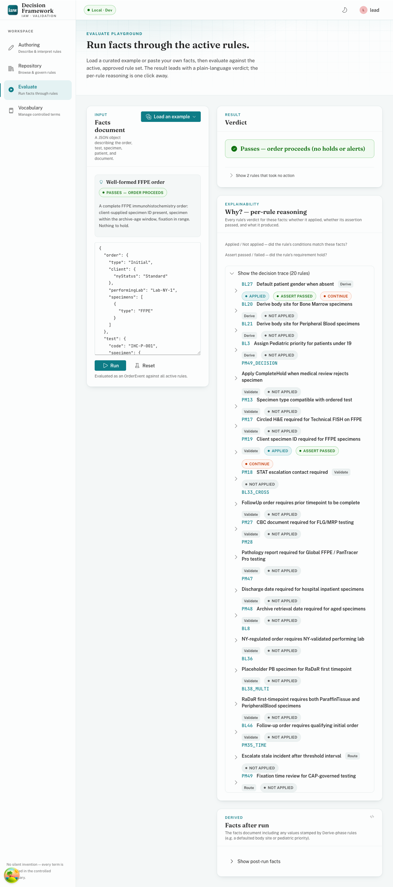
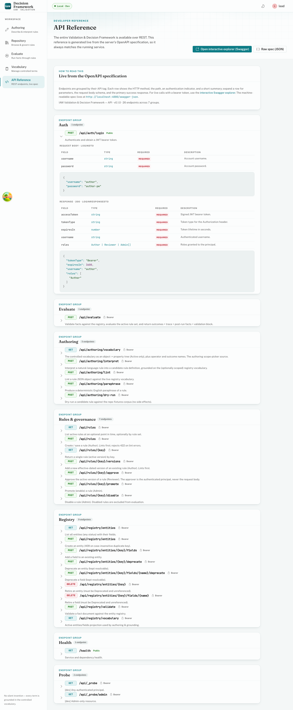

# IAW Validation & Decision Framework — User Guide

> **The framework decides; the host application acts.**
>
> This guide covers every screen of the React application, role by role. Whether you are describing
> a new rule in plain English, reviewing its logic before approval, running a fact document through
> the active rule set, or growing the controlled vocabulary, this document walks you through the
> complete workflow.

---

## Table of Contents

1. [What the VDF is for](#1-what-the-vdf-is-for)
2. [Roles at a glance](#2-roles-at-a-glance)
3. [Getting started — sign in and navigate](#3-getting-started--sign-in-and-navigate)
4. [Core concept — how a rule works](#4-core-concept--how-a-rule-works)
5. [Authoring](#5-authoring)
6. [Repository](#6-repository)
7. [Evaluate](#7-evaluate)
8. [Vocabulary (Admin)](#8-vocabulary-admin)
9. [API Reference](#9-api-reference)
10. [Troubleshooting and FAQ](#10-troubleshooting-and-faq)
11. [Glossary](#11-glossary)

---

## 1. What the VDF is for

Clinical order processing in a genomics lab is governed by hundreds of business and compliance rules:

- "If the client is NY-regulated, the performing lab must be on the NY-validated list."
- "Bone Marrow specimens without a body site get one stamped automatically."
- "CAP-governed tests with fixation time outside the 6–72 hour window are routed to medical review."

Hard-coding these rules into application code makes them invisible, untestable, and impossible to
audit. The Validation & Decision Framework solves this by treating rules as **data** — stored,
versioned, effective-dated definitions that a pure deterministic engine evaluates against a fact
document.

**What the VDF produces:**

- A set of **outcomes** that tell the host application what to do (hold the order, route to a queue,
  stamp a derived value, create a placeholder specimen record, block an action).
- A full **decision trace** — per-rule, per-condition reasoning that explains exactly why each
  outcome was or was not produced.

**What the VDF never does:** it does not place holds, route orders, or create records itself. It
returns *what should happen*; the host application carries those instructions out.

**Natural-language authoring is a compile-time convenience.** The LLM interpreter translates plain
English into a candidate rule expressed in the controlled vocabulary. That candidate must pass a
deterministic validation gate (schema check plus registry lint) before it can be saved. Once stored,
the rule is evaluated by a fully deterministic engine — **the LLM is never in the runtime decision
path.**

---

## 2. Roles at a glance

| Role | What they can do |
|---|---|
| **Author** | Describe rules in plain English, interpret, lint, paraphrase, dry-run, and save draft rules. |
| **Reviewer** | Approve the active version of a saved rule. |
| **Admin** | Promote (enable) or disable rules; manage the entity registry (Vocabulary screen). |
| **Lead** | Holds all three roles — Author + Reviewer + Admin. Useful for end-to-end workflows. |
| Any authenticated user | Evaluate facts, browse the Repository, view the API Reference, read the Vocabulary. |

Role enforcement is defense-in-depth: the API returns `403 Forbidden` independently of the UI, so
UI-level gating is never the only control.

---

## 3. Getting started — sign in and navigate



### 3.1 Sign in

Open the app at `http://localhost:5173`. You will be redirected to the login page if you are not
already authenticated.

The development environment provides four pre-seeded accounts. These are **local-development only**
and must not be used outside a dev environment:

| Username | Password | Roles |
|---|---|---|
| `author` | `author-pw` | Author |
| `reviewer` | `reviewer-pw` | Reviewer |
| `admin` | `admin-pw` | Admin |
| `lead` | `lead-pw` | Author, Reviewer, Admin |

Sign in with `lead` / `lead-pw` to access every feature in one session.

### 3.2 Navigation rail

After signing in, the left rail shows the Workspace navigation:

| Item | URL | Who sees it | What it does |
|---|---|---|---|
| **Authoring** | `/authoring` | All roles | Describe and interpret rules from plain English. |
| **Repository** | `/rules` | All roles | Browse, inspect, and govern stored rules. |
| **Evaluate** | `/evaluate` | All roles | Run a fact document through the active rules. |
| **Vocabulary** | `/vocabulary` | Admin only | Manage the entity registry (entities and fields). |
| **API Reference** | `/api-docs` | All roles | In-app live OpenAPI reference. |

The Vocabulary item is visible only to users with the Admin role.

### 3.3 Theme and user switcher

The **top bar** (the horizontal strip at the top right) provides two controls:

- **Theme toggle** — the sun/moon icon switches between light and dark theme. Both themes meet WCAG
  AA contrast requirements.
- **User menu** — click your username or avatar to see your current roles, switch to a different dev
  user (for testing role-gated behavior without logging out), or sign out.

The green **Local · Dev** chip in the top bar confirms you are connected to the local development
API.

---

## 4. Core concept — how a rule works

You do not need to be an engineer to author rules. This section explains the key ideas in plain
language.

### 4.1 A rule has four parts

Think of a rule as a policy statement with four clauses:

```
WHEN   <gate — when does this policy even apply?>
CHECK  <requirement — what must be true?>
IF OK  <outcome when the requirement holds>
IF NOT <outcome when it does not hold>
```

For example:

> **WHEN** the client is NY-regulated,
> **CHECK** the performing lab is on the NY-validated list.
> **IF OK** — continue (no action).
> **IF NOT** — raise a compliance alert on the order.

There is also an optional **RECOVER** step between "check fails" and "if not": a recovery strategy
the engine tries first (for example, finding an alternate specimen). Only if recovery also fails does
the "if not" outcome apply.

A special case is the **derivation rule**: it has no CHECK, so the engine always runs its outcome.
This is how the system stamps a default value — for instance, "When a Bone Marrow specimen has no
body site, set it to Bone Marrow." The "check" is intentionally absent; the entire logic lives in
the WHEN gate.

### 4.2 The six operator families

Rule conditions are built from leaves of the form `subject operator value`. The subjects are paths
from the registry (`specimen.fixationTime`, `order.client.nyStatus`, etc.). The operators fall into
six families:

| Family | Examples | What they test |
|---|---|---|
| **Presence** | `IsPresent`, `IsAbsent` | Whether a field has a value at all. |
| **Equality** | `Equals`, `NotEquals` | Exact match or mismatch. |
| **Membership** | `InSet`, `NotInSet` | Whether a value is in a list. |
| **Comparison** | `GreaterThan`, `LessThan`, `WithinRange`, etc. | Numeric or date comparisons. |
| **Matching** | `Matches`, `IsCompatibleWith` | Pattern match; often backed by a reference table. |
| **Reference-eligibility** | `IsEligibleFor`, `Exists` | Whether a value qualifies according to a reference data set (e.g. an approved lab list). |

Conditions can be combined with **All** (and), **Any** (or), and **Not**. Collection fields
(lists) can use a **quantifier**: `Any` (at least one member satisfies), `Every` (all members
satisfy).

### 4.3 The five outcome groups

Every outcome produced by a rule belongs to one of five groups:

| Group (UI label) | What it means | Example outcomes |
|---|---|---|
| **Holds & alerts** | Block or flag an order, test, or specimen. | `CompleteHold`, `PartialHold`, `Warning`, `ComplianceAlert` |
| **Routing** | Send work to a human or a queue. | `RouteToReview`, `RouteToQueue`, `Escalate` |
| **Records created** | Materialize a new entity. | `CreatePlaceholder`, `CreateIncident`, `CreateTask` |
| **Blocked actions** | Gate a user action. | `PreventAction`, `AllowAction` |
| **Derived values** | Compute and stamp a value onto the facts for later rules to read. | `SetValue`, `ApplyDefault`, `CalculateValue` |

There is also a **No action** category (`Continue`, `Suppressed`) that the engine uses for control
flow. These are not business outcomes.

### 4.4 Phases, priority, and rule chaining

Rules run in a fixed order:

1. **Derive** phase — derivation rules run first and write values back onto the fact document.
2. **Validate** phase — validation and compliance rules run next, able to read any derived values.
3. **Route** phase — routing rules run last.

Within each phase, rules are ordered by **priority** (lower number runs first), then alphabetically
by **key**. This ordering is deterministic and total: the same facts and rules always produce the
same outcomes in the same order.

**Rule chaining** works through derivations: a Derive-phase rule stamps `specimen.bodySite =
"BoneMarrow"`, and a subsequent Validate-phase rule reads `specimen.bodySite` — the derived value
is there. The engine returns the post-derivation fact document as `factsAfter`.

### 4.5 Determinism and the decision trace

The engine is a **pure function**: same facts + same rules + same effective date always yield the
same outcomes. There are no random elements, no calls to external services at runtime, and no side
effects. The LLM is used only at authoring time to translate English; it is completely absent from
the evaluation path.

Every rule that the engine considers produces a **decision trace** entry: did the WHEN gate match?
Did the CHECK pass? What was each leaf condition's resolved value? What outcome was produced? This
trace is the audit record.

### 4.6 No silent invention

Rules can only reference subjects that exist in the **entity registry** — the controlled vocabulary.
If the interpreter encounters a phrase it cannot map to a registered entity path, it surfaces that
phrase as an **unmapped phrase** gap rather than inventing a term. This is the "no silent invention"
guarantee: every path in a rule is a real, registered, typed field.

---

## 5. Authoring



**Who can use this screen:** Author role (and Lead). Any authenticated user can read the vocabulary
tree.

The Authoring screen is at `/authoring`. Its purpose is to turn a plain-English rule description
into a validated, governed rule definition in five steps: **Interpret → Paraphrase → Lint →
Dry-run → Save**.

### 5.1 The two-column layout

The screen is split into two columns:

- **Left column (Step 1 · Input):** natural-language input, scope selector, and example prompts.
- **Right column (Step 2 · Interpretation):** the structured rule candidate, confidence meter,
  unmapped phrases/gaps, and the action toolbar (Paraphrase, Lint, Dry-run, Save).

### 5.2 Step 1 — Scope and describe the rule

**Scope selector (optional but recommended):** Before typing, use the scope selector to narrow down
which entities and fields you are writing about. This grounds the interpreter's vocabulary to a
smaller, more precise set, which improves accuracy and reduces ambiguous interpretations. You can
scope to one or more **objects** (e.g. `specimen`, `order`) or to specific **properties** (e.g.
`specimen.fixationTime`, `test.code`). Property-level scope takes precedence over object-level scope.

If you select an object or property that does not exist in the registry, the interpreter will return
a `400` error — "Unrecognized scope." This is by design: the scope must always resolve to real
vocabulary terms.

**Natural-language textarea:** Type the rule as you would explain it to a colleague. Be specific
about the condition and the consequence. For example:

> "Hold the order complete when a Technical FISH test is ordered on an FFPE specimen but no circled
> H&E slide is on the document."

**Example prompts:** Below the text area, a row of example prompts illustrates common rule patterns.
Clicking one populates the text area so you can see the authoring flow end to end.

**Interpret button:** Click **Interpret** (the sparkle button) to send your description to the
interpreter. The button is disabled if you are not signed in as an Author. While interpreting, a
spinner replaces the icon.

If the interpreter is unavailable (e.g. `OPENAI_ENABLED=false` in a local dev setup), the offline
stub is used — the flow is identical, but the candidate rule is deterministically generated rather
than LLM-produced.

### 5.3 Step 2 — Read the interpretation

After interpreting, the right column shows the result:

**Confidence meter:** A visual gauge from 0 to 1 indicating how confident the interpreter is that
it captured your intent. Treat confidence below about 0.7 as a signal to rephrase and re-interpret.
A low reading usually means the description was ambiguous, or the vocabulary does not have the terms
needed to express it.

**Scope chips (if scoped):** A row of chips shows which objects and properties the interpreter was
grounded on for this run.

**Unmapped phrases (warning — act on these):** If the interpreter could not map one or more phrases
to the controlled vocabulary, they appear as amber badges under "Unmapped phrases (not grounded in
the vocabulary)." An unmapped phrase means the vocabulary **lacks a term** that the rule needs. You
have two options:
1. Rephrase the English to use existing vocabulary terms.
2. Go to the **Vocabulary** screen (Admin) and add the entity or field that is missing, then return
   and re-interpret.

**Gaps:** Advisory notices about things the rule may be missing — for example, a missing outcome
scope, a recovery path, or an effective date. These are not errors but they are worth addressing
before saving.

**Structured rule — View / Edit tabs:** The candidate rule appears as formatted JSON in the View
tab. Switch to the **Edit** tab to modify the JSON directly. This is useful when you want to
adjust a field that the interpreter got approximately right, or to add an optional `recover` step.
The Edit tab validates JSON syntax inline and surfaces parse errors.

A toolbar of actions appears beneath the rule:

- **Paraphrase** — Translates the structured rule back to plain English (see 5.4).
- **Lint** — Checks the rule against the live vocabulary (see 5.5).
- **Dry-run** — Evaluates the candidate against the fixture corpus (see 5.6).
- **Save…** — Opens the Save dialog (see 5.7).

### 5.4 Paraphrase — the round-trip trust check

Click **Paraphrase** to ask the server to render the structured rule back as deterministic English.
The paraphrase appears in a styled block labelled "Trust round-trip."

Read it carefully: **does the paraphrase say what you intended?** This is the test for subtle
errors. For example, if you intended "any specimen on the order" but the rule was generated with
`Every` (all specimens), the paraphrase will say "every specimen" — letting you catch the
quantifier mismatch before saving.

The paraphrase is generated deterministically from the rule structure, so it is not an LLM opinion —
it is a mechanical translation that will read back exactly the same way every time for the same rule.

### 5.5 Lint — the vocabulary gate

Click **Lint** to run the registry-grounded linter against the candidate. The lint report shows:

- **isValid: true** — the rule is valid and can be saved.
- **isValid: false** — one or more Error-severity findings must be resolved.

Common lint codes:

| Code | Meaning | What to do |
|---|---|---|
| `LINT001` | Unknown subject path — the path is not in the vocabulary. | Add the field to the registry, or rephrase to use an existing path. |
| `LINT003` | Unknown reference key — a reference-backed operator points at a non-existent reference data set. | Correct the reference name or add the reference data. |
| `LINT005`–`LINT008` | Missing required outcome parameter — e.g. a `SetValue` outcome is missing a `Target` or `Value`. | Add the missing parameter to the outcome in the Edit tab. |
| `LINT101`, `LINT102` | Warnings (advisory) — the rule is saveable but something looks unusual. | Review and decide whether to address them. |

The governance step (Save) re-lints on the server. A rule with Error findings returns `422` and
cannot be saved until it lints clean.

### 5.6 Dry-run — preview on fixtures

Click **Dry-run** to evaluate the candidate rule against the fixture corpus — a set of representative
fact documents that live in the server. This is a **no-side-effects** sandbox: nothing is written,
no outcomes are persisted.

The dry-run result shows:
- How many fixtures were evaluated.
- For each fixture: whether the WHEN gate matched (`applied: true/false`), and what outcome was
  produced.

Use the dry-run to confirm the rule fires on the scenarios it should and stays silent on the ones it
should not, **before it touches production rules.**

### 5.7 Save — governing the rule

Click **Save…** to open the Save dialog. Before sending the request, the server re-lints; if the
rule has any Error findings, the save is rejected with `422` and the lint report is shown inline.

The Save dialog records optional provenance:

- **Author NL** — the original natural-language text is pre-filled from the input area. This is
  stored as a provenance artifact on the rule version so reviewers can see what the author intended.
- **Interpreter version** — an optional stamp identifying which version of the interpreter was used.

On success (`201 Created`), the rule appears in the Repository at version 1 with `Pending` approval
status. A Reviewer must approve it, and an Admin must promote it, before it participates in
evaluation.

**Governance lifecycle:**

```
Author saves  →  Reviewer approves  →  Admin promotes  →  Rule is live
                                         (Admin can also disable)
```

---

## 6. Repository

**Who can use this screen:** All authenticated users (read). Reviewer can approve; Admin can
promote/disable.

The Repository is at `/rules`. It shows all stored rules and provides governance actions on each.

### 6.1 The rule list

The list displays a table with columns:

| Column | Description |
|---|---|
| **Key** | The stable rule identifier (e.g. `PM17`, `BL8`). |
| **Name** | Human-readable rule name. |
| **Rule set** | The named subset the rule belongs to (e.g. `PreMolecular`). |
| **Phase** | `Derive`, `Validate`, or `Route`. |
| **Version** | The current active version number. |
| **Status** | `Enabled` (participating in evaluation) or `Disabled` (excluded). |

A search box at the top filters the list by key, name, rule set, phase, or description. The count
above the table updates dynamically.

Click any row to open the rule detail page.

### 6.2 Rule detail page

The detail page has two columns: the structured rule and scope on the left, and governance and
provenance on the right.

**Left column:**

- **Operates on (scope):** Shows the entity objects and properties this rule reads. If the author
  explicitly scoped the rule via the scope selector at authoring time, this section is labelled
  "Authored" — the author's deliberate framing of the rule's subject matter. If no authored scope
  was recorded, the scope is derived automatically from the rule's condition tree. When both are
  available, the authored scope leads and the derived scope appears below it for reconciliation.

- **Structured rule (Definition):** The full rule JSON, rendered as syntax-highlighted JSON. A
  **Paraphrase** button is available here too — you can request a plain-English rendering directly
  from the Repository without going to the Authoring screen.

**Right column:**

- **Governance panel:** Shows the current approval and enabled status, version, phase, priority, rule
  set, and effective date. The governance actions available depend on your role:
  - **Reviewer:** "Approve active version" — records the authenticated principal as the approver.
    The button is disabled once the rule is already approved.
  - **Admin:** "Promote (enable)" — makes the rule eligible for evaluation. "Disable" — removes it
    from evaluation (it remains in the repository for audit).
  - Read-only users see a note confirming they have read-only access.

- **Authoring trail (Provenance):** Shows who authored the rule, which interpreter version was used,
  and the original natural-language source (the author's plain-English description stored at save
  time).

### 6.3 Versioning and effective-dating

Each time a rule is updated, a new **version** is appended immutably to the rule's history. The
engine selects the version whose effective window contains the evaluation's `asOf` instant
(`effectiveDate ≤ asOf < expiryDate`). This means:

- Past evaluations can always be replayed exactly — the rule that was active at a historical instant
  can be retrieved.
- A future-dated version can be staged: it will activate at its `effectiveDate` without manual
  intervention.
- Old versions are never deleted; they are part of the permanent audit trail.

---

## 7. Evaluate

A clean **pass** and a **held** result (the verdict leads; each outcome names its rule):




The collapsible decision trace shows every rule by key **and name**:



**Who can use this screen:** All authenticated users.

The Evaluate screen is at `/evaluate`. Its purpose is to run a fact document through the active,
enabled rule set and show a plain-language verdict with full per-rule reasoning.

### 7.1 Loading a scenario or pasting facts

**Scenario picker:** The "Load example" dropdown in the top right of the facts panel groups curated
scenarios into three shelves:

| Shelf | What it demonstrates |
|---|---|
| **Passes** | A well-formed fact document that produces no holds or alerts. |
| **Fails** | A fact document designed to trip exactly one business outcome. |
| **Derivations** | A fact document that stamps a derived value with no holds. |

Each scenario shows a name, a one-line description, and the expected result (e.g. "Complete Hold
(PM17)"). Loading a scenario populates the facts editor and sets the trigger type automatically.

**Facts editor:** A monospaced JSON text area containing the entity-keyed fact document. Edit it
freely. JSON parse errors appear inline below the editor.

**Run / Reset buttons:**
- **Run** — evaluates the current facts against all active rules. Disabled while parsing fails.
- **Reset** — reloads the default starter scenario (a well-formed FFPE order that passes).

The footer of the input panel shows which trigger type the evaluation will use (`OrderEvent` by
default, `DecisionReturned` for certain scenarios).

### 7.2 The Verdict

After running, the right column shows the result starting with the verdict banner.

**Passes (green):** "Passes — order proceeds (no holds or alerts)." If any derivations ran, a
secondary note counts them: "N values derived — see 'Records created / Derived values' and Facts
after run below."

**Holds / alerts raised (amber/red):** "N holds / alerts raised." Below the headline, each business
outcome is listed in condensed form:

- The **rule key** (e.g. `PM17`) in a monospace chip.
- The **rule name** (e.g. "Circled H&E required for Technical FISH on FFPE").
- The **group label** (e.g. `Holds & alerts`).
- The **reason** (the human-readable explanation the rule author wrote).
- The **scope** (which entity the outcome concerns, e.g. `scope: order`).

Below the headlines, the banner lists the rule keys that triggered the business outcomes:
"Rules triggered (2): PM17, BL8."

### 7.3 Outcome groups (detail)

Below the verdict banner, the **OutcomesPanel** lists outcomes grouped under friendly headings:

| Group heading | What it contains |
|---|---|
| **Holds & alerts** | Validation group: holds and compliance alerts. |
| **Routing** | Workflow group: routes to queues or reviewers. |
| **Records created** | Entity group: placeholders, incidents, tasks created. |
| **Blocked actions** | Control group: actions that were prevented or allowed. |
| **Derived values** | Derivation group: values stamped onto the facts. |

Each outcome card shows:
- The outcome **type** (e.g. `CompleteHold`, `RouteToReview`).
- The **scope** entity.
- The **rule key** and **rule name** that produced it.
- The **reason** text.
- Any structured **parameters** (e.g. `path: specimen.bodySite, value: BoneMarrow`).

**Rules that took no action:** A toggle at the bottom reads "Show N rules that took no action."
Clicking it expands a list of rules that produced `Continue` or `Suppressed` outcomes — the rules
that ran but found nothing to act on for these facts. Collapsed by default to avoid noise.

### 7.4 Why? — the decision trace

A collapsible "Why? — per-rule reasoning" panel (labelled "Explainability") shows one entry for
every rule the engine considered.

The panel header states how many rules were in the trace. Expand it to see each rule's entry:

- The rule key and name.
- **Applied / Not applied** — whether the WHEN gate matched these facts.
- **Assert passed / failed** — whether the CHECK held.
- The **leaf conditions** with their resolved left and right values and their individual results.
- What outcome was **produced**.

This trace is the "Why?" answer for any outcome. It is also the audit record: the same trace is
persisted append-only under a correlation ID on the server (without PHI or fact values).

### 7.5 Facts after run

A collapsible "Facts after run" panel shows the fact document as it existed **after** all
Derive-phase rules ran. This is where you read derived values: for example, if a Derive rule stamped
`specimen.bodySite = "PeripheralBlood"`, the value appears here even though it was absent in the
input.

### 7.6 Registry validation banner

Between the verdict and the outcome groups, a validation banner appears when the facts document
contains fields that do not conform to the registry:

- **All valid:** no banner (or a subtle "validated" note).
- **Mismatches found:** An amber or error banner lists each entity-scoped error (e.g.
  `specimen.type: must be equal to one of the allowed values`). This is a non-blocking warning in
  the default (non-strict) mode; the outcomes are still shown alongside it. It tells you which
  fields in your fact document are out of spec with the registry.

---

## 8. Vocabulary (Admin)

**Who can use this screen:** Admin role (and Lead). All authenticated users can read the vocabulary
via the API.

The Vocabulary screen is at `/vocabulary`. It is the management interface for the **entity
registry** — the controlled list of domain objects and their typed fields that all rules are
grounded on.

**Key principle:** The registry is the only source of vocabulary. Rules cannot reference a subject
path that does not exist as an Active entity.field in the registry. Adding a term here makes it
available to authoring immediately; deprecating it removes it from the authoring scope picker while
keeping live rules that reference it working.

### 8.1 Entities grouped with their fields

The page displays each entity in a panel, showing:

- The entity **key** (the canonical lower-case identifier, e.g. `specimen`).
- The entity **label** (e.g. "Specimen") and **status** (`Active` or `Deprecated`).
- A table of the entity's **fields**, each row showing:
  - **Path** — the full subject path in monospace (e.g. `specimen.fixationTime`).
  - **Data type** — `String`, `Number`, `Date`, `Boolean`, or `Collection`.
  - **Allowed values** — the closed enum, if any (e.g. `FFPE · FreshTissue · BoneMarrow · …`).
  - **Status** — `Active` or `Deprecated`.
  - **Required** — whether the field is required within its entity sub-document.

Deprecated rows are visually dimmed.

### 8.2 The eight canonical seeded entities

The registry ships with eight entities that model the clinical transaction domain:

| Entity key | What it represents | Notable fields |
|---|---|---|
| `order` | A test order placed against a patient. | `type`, `client.nyStatus`, `performingLab`, `specimens[]`, `tests[]` |
| `test` | An individual test within an order. | `code`, `specimen.type`, `priority`, `capGoverned` |
| `specimen` | A physical specimen submitted for testing. | `type` (enum), `age`, `fixationTime`, `bodySite`, `archiveRetrievalDate` |
| `patient` | The patient associated with an order. | `age`, `gender` (enum: Male/Female/Other) |
| `document` | A document accompanying an order or specimen. | `circledHE` |
| `incident` | An operational incident. | `ageHours` |
| `medicalReview` | A human medical-review decision step. | `decision` |
| `priorTimepoint` | A prior timepoint in a longitudinal order. | `status` |

### 8.3 Adding an entity

Click **Add entity** (top right of the page). Provide:

- **Key** — a single-word camelCase or lowercase identifier. Must start with a letter, contain only
  letters and digits, and be unique **case-insensitively** across the registry. `Kit` and `kit`
  would conflict; only one can exist.
- **Label** — a human-readable display name (defaults to the key if omitted).
- **Description** — optional context for authors and reviewers.

On success, the new entity appears in the list with no fields and `Active` status. A success toast
reminds you to add fields to make its facts authorable.

**Think carefully before adding entities.** Each entity you add becomes part of the fact contract
that the host application must supply at evaluation time. If you add a `kit` entity with a
`shipMode` field, the host system must include `kit.shipMode` in the facts it POSTs to the evaluate
endpoint for that field to be usable at runtime.

### 8.4 Adding a field

Click **Add field** in the page header or on the "Add field" button within an entity's panel. The
Add Field dialog requires you to **select an entity from a dropdown** — you cannot type a free-form
entity name. This enforces the controlled-list guarantee.

Provide:
- **Entity** — select from the dropdown of Active entities.
- **Field name** — a dot-separated path relative to the entity (e.g. `fixationTime`,
  `client.nyStatus`, `specimens[]`). May end in `[]` for a collection field.
- **Data type** — `String`, `Number`, `Date`, `Boolean`, or `Collection`.
- **Required** — whether the field must be present in the entity sub-document.
- **Allowed values** — an optional closed enum. Enter values separated by commas or new lines.
  Empty means "any value of the declared type."
- **Description** — optional.

On success, the field appears immediately in the entity's table, and its path is available to the
authoring scope picker on the next interpretation.

### 8.5 Deprecating and retiring terms

**Deprecate** signals that a term should no longer be used for new rule authoring. Effects:

- The term is hidden from the vocabulary projection (the authoring scope picker and the LLM
  grounding no longer offer it).
- Existing rules that reference the term continue to work — the engine can still resolve it.
- The term is still visible in the Vocabulary screen (dimmed).

Use Deprecate when you are migrating rules off an old term. The workflow is:
1. Add the replacement term.
2. Migrate existing rules to the new term.
3. Deprecate the old term.
4. Retire it once all references are gone.

**Retire** permanently removes a term. This is only permitted when the term is already
`Deprecated` AND is **not referenced by any rule**. The UI shows a Retire button only on
Deprecated items. If a rule still references the term, retirement is blocked with a `409 Conflict`
error.

Retirement is irreversible. Use it only for cleanup after all rules have been migrated off the term.

### 8.6 Validate facts

At the bottom of the Vocabulary page, a **Validate facts** panel lets you paste a facts document
and check it against the registry without running a full evaluation. This is useful for debugging
host-side fact assembly before wiring it into the evaluate endpoint.

Enter the entity-keyed JSON and click Validate. The result shows `valid: true/false` and a list of
entity-scoped errors (path + message, never the fact values themselves, so the output is PHI-safe).

---

## 9. API Reference



**Who can use this screen:** All authenticated users.

The API Reference screen is at `/api-docs`. It renders the live OpenAPI specification directly from
the running NestJS server — it cannot drift from the actual API.

The reference shows each endpoint group (Auth, Evaluate, Authoring, Rules, Registry, Health) with
request/response shapes, HTTP status codes, and role requirements.

For interactive exploration with a real bearer token, open the Swagger UI at
`http://localhost:4000/swagger`:

1. Expand the `POST /api/auth/login` endpoint.
2. Click **Try it out**, enter `{"username":"lead","password":"lead-pw"}`, and execute.
3. Copy the `accessToken` from the response.
4. Click **Authorize** at the top, enter `Bearer <accessToken>`, and authorize.
5. Any endpoint can now be exercised directly.

For detailed narrative documentation of every endpoint, request shape, response shape, and error
model, see:

- [`docs/API.md`](./API.md) — curated API reference with examples.
- [`docs/INTEGRATION_GUIDE.md`](./INTEGRATION_GUIDE.md) — how a host application integrates with
  the VDF over REST.

---

## 10. Troubleshooting and FAQ

**"Interpret says a phrase is unmapped."**

The interpreter could not map one or more words in your description to any path in the controlled
vocabulary. This means the vocabulary lacks a term you need. Either:

1. Rephrase the rule to use existing vocabulary terms (check the scope picker to see what is
   available).
2. Go to the Vocabulary screen (Admin role), add the entity and/or field, then re-interpret.

**"Lint returns LINT001: Unknown subject path."**

A subject path in the rule JSON does not exist in the Active registry. This often happens if you
edited the JSON manually and introduced a typo, or if the corresponding field was deprecated after
the rule was interpreted. Correct the path in the Edit tab or add the missing field to the registry.

**"The rule was saved but it is not affecting evaluations."**

A saved rule participates in evaluation only when it is both **Approved** (by a Reviewer) and
**Promoted/Enabled** (by an Admin). Check the rule's detail page in the Repository — if Approval
shows "Pending" or State shows "Disabled," complete the governance workflow.

**"The rule fires at authoring (dry-run) but not at runtime."**

The host application must supply the fact paths the rule references. If `specimen.fixationTime` is
missing from the fact document the host POSTs to `/api/evaluate`, the engine cannot evaluate any
condition on it. Check the `validation` block in the evaluate response to see which fields are
missing or mismatched against the registry.

**"Save returns a 422 with lint findings even though Lint passed."**

The governance endpoint re-lints on the server using the current live registry. If the registry was
modified between your lint run and your save (e.g. a field was deprecated), the save-time lint may
surface new findings. Re-run Lint and resolve them.

**"Retirement is blocked with a 409 conflict."**

The entity or field you are trying to retire is still referenced by at least one rule. Identify
which rules reference it (use the Repository search), update or disable those rules, then retry.

**"The interpreter returns 503."**

The LLM interpreter service is unavailable (either `OPENAI_ENABLED=false` in the local `.env` is
expected, or the OpenAI API is down). With `OPENAI_ENABLED=false`, the offline stub interpreter is
used automatically — you will still get a candidate, but it will be deterministically generated
rather than LLM-produced. If you need the live interpreter, set `OPENAI_ENABLED=true` and provide a
valid `OPENAI_API_KEY` in `src/server/.env`.

**"I can see the Vocabulary nav item but someone else cannot."**

The Vocabulary nav item is only shown to users with the **Admin** role. Confirm the user's roles by
clicking their username in the top bar. To get Admin access in the dev environment, sign in as
`admin` / `admin-pw` or `lead` / `lead-pw`.

---

## 11. Glossary

| Term | Definition |
|---|---|
| **Entity** | A registered domain object (noun/class). Examples: `order`, `specimen`, `test`, `patient`. Entities are the top-level keys in a fact document. |
| **Field** | A typed property on an entity, accessed as `entity.fieldName` (e.g. `specimen.fixationTime`). Fields have a data type, an optional `required` flag, and an optional `allowedValues` enum. |
| **Fact** | A value supplied at evaluation time for a specific entity field (e.g. `specimen.fixationTime = 24`). Facts are assembled by the host application into an entity-keyed JSON document. |
| **Fact document** | The JSON object keyed by entity that is POSTed to `/api/evaluate`. Shape: `{ "specimen": { "fixationTime": 24 }, "order": { … } }`. |
| **Rule** | A versioned, effective-dated policy definition stored in Postgres. Has four parts: WHEN (`appliesWhen`), CHECK (`assert`), ON SUCCESS (`onSuccess`), and ON FAILURE (`onFailure`), plus an optional `recover` step. |
| **WHEN / appliesWhen** | The applicability gate of a rule. If absent, the rule always applies. If present, the rule is evaluated only when the gate conditions hold. |
| **assert** | The main CHECK of a rule — the condition that must hold. If absent (degenerate derivation rules), the engine "fails through" to `onFailure`, which is where derivation rules place their `SetValue` outcome. |
| **Outcome** | A decision produced by a rule. Each outcome has a `type` (e.g. `CompleteHold`, `SetValue`), a `group` (e.g. `Validation`, `Derivation`), a `scope`, a `reason`, and `parameters`. |
| **Phase** | One of three ordered execution buckets: `Derive` (runs first), `Validate`, `Route` (runs last). Derivations run in the Derive phase so their results are visible to later phases. |
| **Derivation** | A rule outcome that writes a value back into the fact document (e.g. `SetValue`, `ApplyDefault`). Derivation rules typically have no `assert` — they always produce their outcome when the WHEN gate matches. |
| **Decision trace** | The per-rule explainability record produced by the engine. One entry per evaluated rule; contains the WHEN result, the per-leaf condition values and results, the assert result, any recovery attempt, and the produced outcome. |
| **Vocabulary** | The controlled list of Active entity/field paths that rules and the LLM interpreter are grounded on. Managed via the Vocabulary screen (Admin). Exposed at `GET /api/registry/vocabulary`. |
| **Scope** | The subset of vocabulary entities and/or fields that an interpret request is narrowed to. Also used in the Repository to describe which objects and properties a rule operates on. |
| **factsAfter** | The fact document as it exists after all Derive-phase rules have run and stamped their derived values. Returned by the evaluate endpoint; readable via the "Facts after run" panel. |
| **Lint** | The registry-grounded static validation of a rule definition. Every subject path and value must resolve to the controlled vocabulary. Lint is the deterministic gate that stands between LLM output and a stored rule. |
| **Paraphrase** | A deterministic English back-translation of a structured rule definition. Used to confirm the rule says what the author intended (the "round-trip trust check"). |
| **Dry-run** | A no-side-effects evaluation of a candidate rule against the fixture corpus. Shows which fixtures the rule would fire on before it is saved. |
| **Governed** | A rule that has completed the Author → Reviewer → Admin lifecycle (saved, approved, and promoted). Only governed, enabled rules participate in evaluation. |
| **Effective-dated** | A rule version whose `effectiveDate` and optional `expiryDate` define the window during which it is the active version. The engine selects the version active at the `asOf` instant. |
